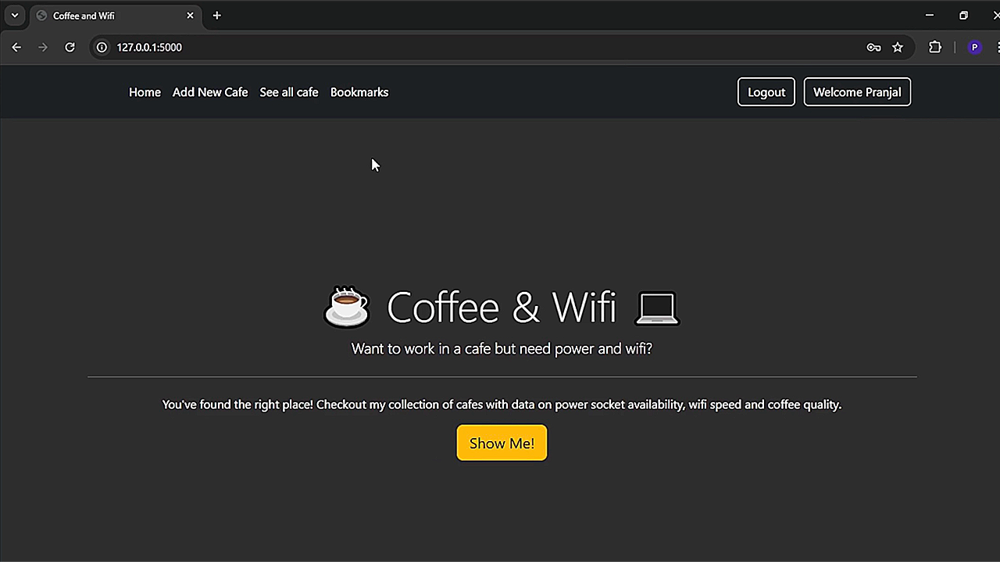

# Coffee and Wifi
A **Flask web app** where users can **register, log in, add new cafes, view cafes, and bookmark favorites**. Users must log in to **bookmark/unbookmark** cafes. The app features **flash messages for errors** and **database-backed storage** with relationships between **User, Cafe, and Bookmark tables**.  

## Video
[](https://www.google.com/)

## Author
Pranjal Sarnaik

## Features
- **User Authentication** (Register/Login).  
- **Add & View Cafes** with details like name, location, and rating.  
- **Bookmark Cafes** (Add/Remove favorites).  
- **Flash Messages** for errors and notifications.  
- **Database Storage** with relationships.  

## Level
Intermediate

## Tech Stack
Flask | SQLAlchemy | Flask-Login | Bootstrap | WTForms | Jinja2 | Flask-WTF | SQLite | Web Development | Authentication & Authorization | Python

## How to Run
1. Clone the repo:  
   ```bash  
   git clone https://github.com/pranjalco/flask-coffee-and-wifi.git

2. Run(Also install required libraries):
    ```bash
   pip install -r ./requirements.txt
   python main.py
   ```

**Created by Pranjal Sarnaik**  
*Released under the MIT License*